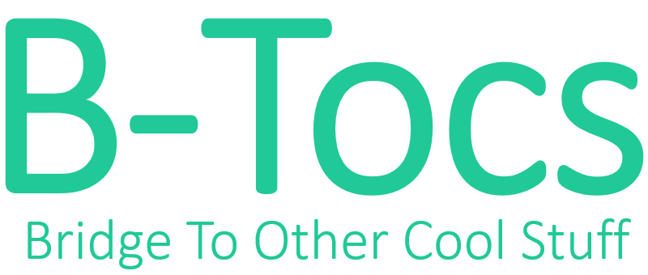
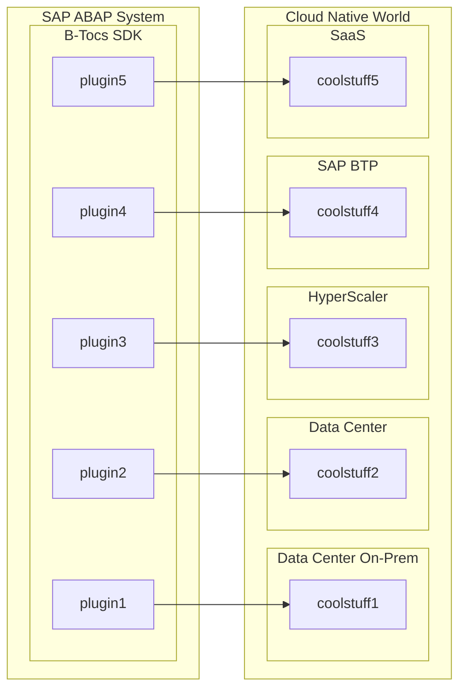

# B-Tocs ABAP SDK

## Summary 

Welcome to the B-Tocs ABAP SDK. With this ABAP extension your SAP ABAP Server can connect to other cool stuff.

This ABAP package is an free to use ABAP at your own risk.  You can install it via [abapGit](https://www.abapgit.org).
See the [Youtube Channel](https://youtube.com/channel/UCk4K1ZKPW4sdngJPcYeHJCA) for videos regarding this ABAP addon and the available Plugins.

## Architecture

## Known plugins
- [LibreTranslate](https://github.com/b-tocs/abap_btocs_libtrl) - Translation

## Prerequisites

SAP ABAP from 7.40 until current S/4 HANA on premise releases (e.g. 7.5x)

## Known Issues

- 

last modified: 17.01.2024
