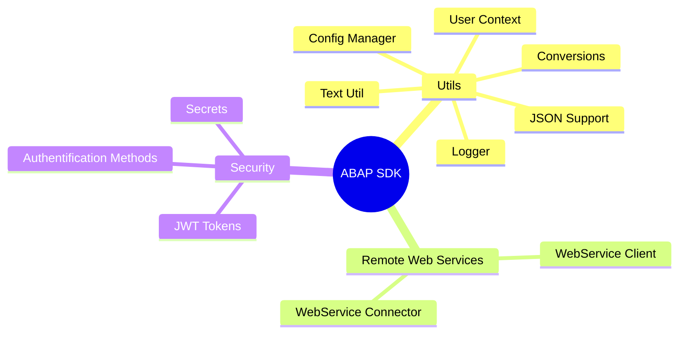
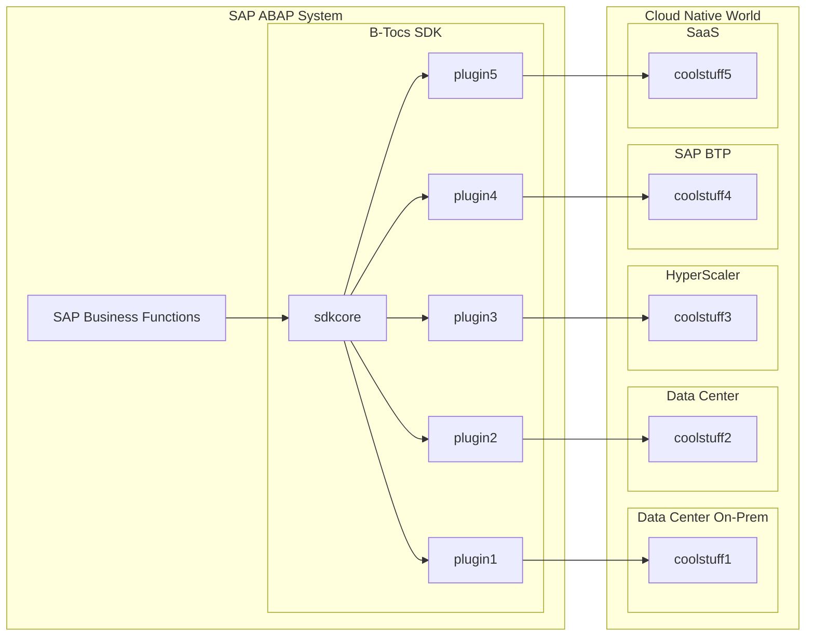

# B-Tocs ABAP SDK

## Summary 

Welcome to the B-Tocs ABAP SDK. With this ABAP extension your SAP ABAP Server can connect to other cool stuff.

This ABAP package is a free to use at your own risk.  You can install it via [abapGit](https://www.abapgit.org).

See the [Youtube Channel](https://youtube.com/channel/UCk4K1ZKPW4sdngJPcYeHJCA) for videos regarding this ABAP addon and the available Plugins.

## Features

## Architecture

## Known plugins

| Plugin                | Solution                                              | Category              | Repository                                                |
| ---                   | ---                                                   | ---                   | ---                                                       |
| DEEPL                 | [DeepL](https://deepl.com/)                           | Translation           | https://github.com/b-tocs/abap_btocs_deepl                |
| LIBTRL                | [LibreTranslate](https://libretranslate.com/)         | Translation           | https://github.com/b-tocs/abap_btocs_libtrl               |
| OLLAMA                | [Ollama](https://ollama.ai/)                          | LLM, Chatbot, GPT     | https://github.com/b-tocs/abap_btocs_ollama               |

Planned:
- Stirling PDF

## Prerequisites and Installation 

- SAP ABAP from 7.50 releases until current S/4 HANA on premise 
- Package name:
    - ZBTOCS_CORE - if your system will be upgraded in the future 
    - otherwise $ZBTOCS_CORE or $BTOCS_CORE without transport requests

## Demos

| SAP object                    | Description                           |
| ----------------------------- | ------------------------------------- |
| PROG ZBTOCS_GUI_DEMO_RWS_CALL | B-Tocs Demo - Call Remote Web Service |

## Known Issues
- SSL - SAP Basis issue depending on remote certificates in older systems
